<div align="center">

# lithium-orderbook-imbalance-cpp

**[English](README.md) | [Español](README.es.md)**


Motor C++20 en streaming, sin dependencias externas, que puntúa el
desbalance del flujo de órdenes para acciones de litio, sobre ventanas
de 500ms, contra un **estimador robusto de mediana/MAD calibrado a una
distribución Student-t** (no un EWMA gaussiano — ver
[Por qué MAD + Student-t](#por-qué-mad--student-t-y-no-un-ewma-gaussiano)).

**Autor:** Pablo Reyes ([@Rxyxs](https://github.com/Rxyxs))

</div>

## Resumen

Las acciones del sector litio (SQM, Albemarle, Pilbara Minerals) están
expuestas a shocks bruscos de flujo de órdenes ligados a noticias de
demanda de vehículos eléctricos y de la cadena de suministro de
baterías. Este motor lee una cinta de ticks tick-a-tick en modo
streaming (memoria constante, línea a línea — escala a archivos de
varios gigabytes) y, por símbolo, en ventanas de 500ms, calcula el
**desbalance de volumen firmado** (volumen comprador menos volumen
vendedor) contra un estimador robusto de mediana y Desviación Absoluta
Mediana (MAD), calibrado a una distribución Student-t, marcando las
ventanas cuyo desbalance es estadísticamente anómalo respecto al
régimen reciente propio de ese símbolo — sin la tasa excesiva de falsas
alarmas que tiene un estimador gaussiano sobre datos de trading de cola
pesada (ver
[Por qué MAD + Student-t](#por-qué-mad--student-t-y-no-un-ewma-gaussiano)).

Está construido como un **proyecto C++20 nativo para MSVC, con cero
dependencias externas** — sin CMake, sin vcpkg, sin librerías de
terceros. Solo `cl.exe` y la librería estándar.

## Valor de negocio

- **Monitoreo de riesgo específico del sector**: a diferencia de una
  herramienta genérica de detección de anomalías en ticks, este motor
  está calibrado para una tesis concreta y volátil — shocks de
  oferta/demanda en litio y metales para baterías — de modo que un
  desk con exposición concentrada en nombres tipo SQM/ALB/PLS recibe
  alertas acotadas al riesgo que realmente carga, sin ruido de
  sectores no relacionados.
- **Ángulo de vigilancia de mercado**: un desbalance de flujo de
  órdenes estadísticamente anómalo y sostenido es también un insumo
  estándar en flujos de trabajo de vigilancia de mercado (detectar
  posible filtración de información o manipulación por momentum antes
  de una noticia pública), no solo una señal de trading.
- **Baja latencia y sin dependencias por diseño**: un único binario
  nativo sin un árbol de dependencias en tiempo de ejecución que
  administrar, procesando volúmenes reales de ticks a ~652.000
  ticks/segundo en hardware estándar (ver
  [Resultados](#resultados-corrida-real-no-estimados)) — apto para
  integrarse directamente en infraestructura de trading o riesgo en
  C++ ya existente, sin introducir un nuevo toolchain.
- **Arquitectura en streaming**: memoria constante sin importar el
  tamaño de la entrada, por lo que puede correr de forma continua
  contra un feed en vivo o reproducir cintas históricas de varios
  gigabytes sin necesidad de rediseño.

## Impacto de Negocio e Indicadores Clave (KPIs)

| Métrica | Resultado | Qué significa |
|---|---|---|
| Reducción de falsas alarmas, MAD+Student-t vs. EWMA Gaussiano | 10 vs. 296 alertas (~30x) | Mismo dataset de 2 horas y 871K ticks -- estimador robusto, no un ajuste de sensibilidad |
| Falsos positivos fuera de la ventana del shock inyectado | **0** en 43.200 ventanas | Las 10 alertas caen todas dentro de la ventana real de 5 segundos del shock |
| Throughput | ~651.900 ticks/s | Costo real y medido del estimador robusto: ~6% más lento que el EWMA Gaussiano (~696.000 ticks/s), un trade-off honesto, no escondido |
| Margen de detección del shock | Estadístico pico 47,37, 7,2x el umbral de alerta | Un margen de seguridad absoluto materialmente mayor que la versión Gaussiana anterior |
| Robustez a colas pesadas sintéticas (test unitario) | 37 alertas EWMA Gaussiano vs. 1 alerta robusta | Mismo efecto reproducido sobre ruido puro de colas pesadas, sin ningún shock inyectado |

## Stack tecnológico

| Capa | Elección | Por qué |
|---|---|---|
| Lenguaje | C++20 | Rendimiento determinístico, sin pausas de garbage collector, control directo del layout de memoria para una carga en streaming sensible a la latencia (`std::span` usado en las funciones de estadística robusta) |
| Compilador / toolchain | MSVC (`cl.exe`, Visual Studio 2019 Build Tools) | Toolchain nativo de Windows, sin sistema de build externo requerido |
| Dependencias | Ninguna (solo librería estándar) | Superficie de cadena de suministro nula, trivial de integrar en un codebase existente |
| Build | Un único script PowerShell (`build.ps1`) | Sin capa CMake/vcpkg; localiza `vcvars64.bat` e invoca `cl.exe` directamente |
| Testing | Asserts escritos a mano (`tests/test_engine.cpp`) | Consistente con la política de cero dependencias — sin framework de tests externo |
| Intercambio de datos | CSV plano | Simple, inspeccionable, y trivialmente reemplazable por la exportación real de un proveedor de datos de mercado que respete el mismo esquema |

## Arquitectura

```mermaid
flowchart LR
    A[archivo CSV de ticks] -->|streaming, linea a linea| B[CsvTickReader]
    B --> C[OrderFlowImbalanceEngine]
    C -->|por simbolo, ventanas 500ms| D["buy_volume - sell_volume\n= net_imbalance"]
    D --> E["Tracker RobustZScore\nmediana / MAD por simbolo"]
    E -->|t-stat robusto| F{"&#124;t&#124; &ge; valor critico\nStudent-t?"}
    F -->|si| G[fila de alerta + log en consola]
    F -->|no| H[fila en results.csv]
    G --> H
```



**Responsabilidad de cada componente:**

- `CsvTickReader` — parsea una línea a la vez desde disco mediante un
  `std::ifstream` con buffer; el archivo nunca se carga completo en
  memoria, así que el uso de memoria se mantiene constante sin importar
  el tamaño del archivo. Las filas malformadas se descartan y se
  cuentan, en vez de abortar el stream.
- `OrderFlowImbalanceEngine` — mantiene estado independiente por
  símbolo (`unordered_map<simbolo, estado>`) para que un único stream
  de ticks con varios tickers de litio se procese en una sola pasada.
  Las ventanas están ancladas al tiempo de reloj real: si un símbolo
  queda en silencio, las ventanas vacías intermedias igual se emiten,
  para que el tracker que sigue vea una serie continua y
  equiespaciada, en vez de saltarse silenciosamente hacia adelante.
- `RobustZScore` (`include/robust_zscore.hpp`) — sigue la **mediana y
  la Desviación Absoluta Mediana (MAD)** de una ventana deslizante de
  tamaño fijo con las observaciones recientes por símbolo,
  estandarizando cada observación nueva contra la mediana/MAD de todo
  lo *anterior* a ella (nunca a sí misma). Es el tracker que usa
  `OrderFlowImbalanceEngine` en vivo. Ver
  [Por qué MAD + Student-t, y no un EWMA gaussiano](#por-qué-mad--student-t-y-no-un-ewma-gaussiano)
  para la justificación estadística.
- `robust_stats.hpp` — la matemática detrás de `RobustZScore`: mediana/MAD
  vía `std::nth_element`, y una CDF de Student-t hecha desde cero (vía
  la función beta incompleta regularizada, evaluada por fracción
  continua) usada para convertir un umbral nominal en sigmas gaussianas
  en el valor crítico Student-t correspondientemente más estricto.
- `EwmaZScore` (`include/ewma_zscore.hpp`) — el tracker original de
  media/varianza ponderadas exponencialmente. **Se conserva como
  estimador gaussiano de referencia/legado**, ya no lo usa el motor en
  vivo, específicamente para poder medir su comportamiento de falsas
  alarmas directamente contra `RobustZScore` sobre los mismos datos
  (`tests/test_engine.cpp`,
  `test_robust_estimator_raises_fewer_false_alarms_than_gaussian_ewma`).

## Por qué MAD + Student-t, y no un EWMA gaussiano

La [versión anterior de este motor](#resultados-corrida-real-no-estimados)
marcaba 296 de 43.200 ventanas (0,69%) — notablemente más que el ~0,27%
que predice un umbral gaussiano de 3 sigma — y documentaba esa brecha
como una limitación conocida en vez de esconderla: *"los tamaños de
trade reales tienen sesgo a la derecha (log-normal), no son gaussianos,
así que incluso una cinta sintética ya des-ruidada produce más eventos
de cola de los que espera un supuesto de distribución normal."* Esa
brecha en realidad mezclaba dos problemas independientes, y este cambio
corrige ambos por separado, a propósito:

**Problema 1 — el propio *estimador* no es robusto.** Un EWMA
gaussiano sigue una media y una varianza, y ambas tienen un **punto de
quiebre del 0%**: una sola observación no acotada puede arrastrarlas
arbitrariamente lejos (este es exactamente el mecanismo detrás del bug
del z-score de -184.855 documentado en `ewma_zscore.hpp`, del proyecto
hermano `market-tick-anomaly-engine-cpp`). El desbalance de volumen
firmado está impulsado por tamaños de trade, que tienen sesgo a la
derecha / cola pesada por construcción — un puñado de trades en bloque
grandes rutinariamente empequeñecen a la masa de prints ordinarios —
así que el propio denominador de media/varianza sigue siendo golpeado
por exactamente los valores grandes que un detector debería estar
marcando, en vez de absorberlos hacia su propia base.

**La corrección**: la **mediana** y la **Desviación Absoluta Mediana
(MAD)** tienen un **punto de quiebre del 50%** — hasta la mitad de los
datos de la ventana pueden ser arbitrariamente extremos sin mover la
estimación de ubicación/escala fuera de la masa de la distribución
(Huber, *Robust Statistics*, 1981). `RobustZScore` estandariza cada
observación como:

```
t = (x - mediana) / (MAD * 1,4826)
```

`1,4826 = 1 / Φ⁻¹(0,75)` es la constante de consistencia estándar que
hace que `MAD * 1,4826` sea un estimador insesgado del desvío estándar
*cuando el dato genuinamente es gaussiano* — es lo que permite leer
este estadístico en la misma escala de "a cuántos sigma de distancia"
que el anterior, sin heredar su fragilidad.

**Problema 2 — la *regla de decisión* asumía colas normales.** Incluso
con una escala robusta perfectamente estimada, comparar el resultado
contra un umbral gaussiano fijo (`|z| >= 3,0`) sigue asumiendo
implícitamente que las colas de la distribución subyacente decaen como
las de una Normal. Los datos de cola pesada no lo hacen: un evento "de
3 sigma" es mecánicamente más común bajo una distribución de cola más
pesada de lo que predice una gaussiana, sin importar cuán robustamente
se haya estimado el propio sigma.

**La corrección**: calibrar el umbral de alerta contra una
**distribución Student-t** con pocos grados de libertad (`--dof 4.0`
por defecto, el rango usado comúnmente en finanzas para datos de
retorno/desbalance de cola pesada — ej. Blattberg & Gonedes, 1974).
`--alert-sigma 3.0` se sigue interpretando como *"tan raro como un
evento gaussiano de 3 sigma"* — se convierte al arrancar en la
probabilidad de cola de dos lados `α = erfc(3,0/√2) ≈ 0,27%`
(`gaussian_two_sided_pvalue`), y luego en el valor |t| que le da a una
distribución Student-t(4) esa *misma* probabilidad de cola
(`student_t_critical_value`, encontrado por bisección sobre una CDF de
Student-t hecha desde cero — sin necesitar una función de cuantiles de
forma cerrada). Ese es el valor contra el que efectivamente se compara
`|robust_t_stat|`:

| dof | Valor crítico a α ≈ 0,27% (equivalente a z=3,0 gaussiano) |
|---|---|
| Gaussiano (dof → ∞) | 3,0000 (por construcción) |
| 5 | 5,5070 |
| **4 (default de este proyecto)** | **6,6201** |

Ambas correcciones importan, y ninguna es redundante con la otra: una
estimación robusta de escala por sí sola igual necesita un umbral que
tenga en cuenta cuán pesadas son realmente las colas, y un umbral de
cola pesada aplicado sobre una estimación de media/varianza que ya fue
arrastrada fuera de centro por un outlier sigue puntuando todo respecto
al centro equivocado. Juntas, apuntaron directamente — y corrigieron de
forma medible — la brecha exacta que el README de la versión anterior
señalaba.

## Por qué volumen firmado y no una razón acotada

La primera versión de este motor normalizaba el desbalance a una razón
acotada, `(compras - ventas) / (compras + ventas)` en `[-1, +1]`. Al
correrla contra los datos de ejemplo (más abajo) se expuso un problema
real: en una ventana con pocos trades, esa razón satura trivialmente
cerca de ±1, tanto si el desbalance es un cambio real y sostenido como
si son solo dos trades aleatorios cayendo del mismo lado. El ruido
ordinario se veía tan extremo como un evento real, y un shock de flujo
de órdenes inyectado deliberadamente llegaba apenas a z = 1.8 — muy
por debajo de cualquier umbral de alerta razonable.

La corrección: el z-score ahora sigue el **delta de volumen firmado
crudo**, no la razón. Este escala naturalmente con la participación,
así que un shock que también trae más trades y más grandes (no solo un
sesgo direccional) produce un delta proporcionalmente mayor, en vez de
un valor pegado al techo de la razón. Esto está más cerca en espíritu
de la literatura de order-flow-imbalance (Cont, Kukanov & Stoikov,
2014) — aunque esa formulación se deriva de cambios en el libro de
órdenes (bid/ask), mientras que este motor trabaja a partir de trades
ejecutados, por lo que mide presión realizada del lado tomador
(taker), no cambios en órdenes en el libro. La razón acotada se sigue
reportando junto al delta crudo en el CSV de salida, solo por
legibilidad.

## Sobre los datos

No existe una fuente gratuita y sin autenticación de datos tick-a-tick
reales para acciones individuales, a diferencia de
[data.binance.vision](https://data.binance.vision), que ofrece trades
históricos de cripto gratis — los datos tick/quote reales para
acciones listadas en EE.UU. o en la ASX requieren un proveedor pago o
autenticado (Polygon.io, Databento, LOBSTER, IEX Cloud).
`tools/generate_sample_data.cpp` genera en su lugar datos de ejemplo
claramente sintéticos: precios medios de camino aleatorio
independientes para SQM, ALB y PLS con llegadas de trades tipo
Poisson (seed 42, totalmente reproducible), más un shock de flujo de
órdenes inyectado deliberadamente — una ráfaga de 5 segundos con ~4x
la tasa de llegada de trades, 90% de probabilidad de compra y 3x el
tamaño promedio de trade en SQM — que modela el tipo de presión
compradora sostenida que un titular real de disrupción de oferta o de
demanda produce en acciones de litio.

Para usar datos reales, basta con apuntar el motor a cualquier CSV que
respete el esquema de abajo; no se necesita código específico de
ningún proveedor.

El dataset completo generado (~26MB, 871 mil ticks) es reproducible a
demanda vía `.\build.ps1 -GenData` (seed fija) y no se versiona en git;
`data/lithium_ticks_sample_preview.csv` (las primeras 1.000 filas) y
`data/sample_results_preview.csv` (las ventanas de SQM que cubren el
shock inyectado) sí están en el repo, para que el esquema y la
detección se vean sin necesidad de correr nada.

**Esquema de entrada** (`timestamp_ms,symbol,price,size,side`):

```csv
timestamp_ms,symbol,price,size,side
1000,SQM,52.30,10.5,B
1010,SQM,52.31,5.0,S
```

## Resultados (corrida real, no estimados)

Se generaron 2 horas simuladas de datos tick (871.412 ticks en 3
símbolos, seed 42) y se corrió el motor con la configuración por
defecto (`--window-ms 500 --mad-window 60 --warmup 30 --alert-sigma 3.0 --dof 4.0`):

| Métrica | Valor |
|---|---|
| Ticks procesados | 871.412 |
| Líneas malformadas | 0 |
| Ventanas emitidas | 43.200 (500ms cada una) |
| Throughput | ~651.900 ticks/s |
| Umbral efectivo de alerta | \|robust_t_stat\| ≥ 6,6201 (Student-t(4), calibrado desde alert-sigma nominal=3,0) |
| **Alertas generadas** | **10 (0,023% de las ventanas)** |
| Estadístico pico del shock inyectado | **47,37** (t = 4.322.500ms, SQM) |

**Corregido y medido directamente, no solo afirmado**: la versión
anterior con EWMA gaussiano marcaba 296 alertas (0,69% de las ventanas)
sobre este mismo dataset — ver
[Por qué MAD + Student-t](#por-qué-mad--student-t-y-no-un-ewma-gaussiano)
para el porqué. La versión con MAD + Student-t robusto marca **10**
sobre el *mismo* dataset — una **reducción de ~30x** — y cada una de
esas 10 alertas cae dentro de la ventana real de 5 segundos del shock
inyectado, `[4.320.000, 4.325.000)ms`: **cero falsos positivos en
cualquier otro punto de las 2 horas completas, 43.200 ventanas de la
corrida.** La comparación sintética de falsas alarmas en
`tests/test_engine.cpp`
(`test_robust_estimator_raises_fewer_false_alarms_than_gaussian_ewma`)
reproduce el mismo efecto sobre ruido de cola pesada sin ningún shock
inyectado: 37 alertas con el EWMA gaussiano vs. 1 alerta robusta sobre
las mismas 3.000 ventanas sintéticas.

**El costo honesto**: el throughput baja de ~696.000 a ~651.900 ticks/s
(~6% más lento). Calcular una mediana/MAD exacta es `O(n log n)` por
ventana (vía `std::nth_element`) contra `O(1)` para la actualización de
media/varianza móvil de un EWMA — un trade-off real, pagado a nivel de
ventana (aproximadamente cada 500ms por símbolo, no por tick), que es
por qué cuesta un puñado de puntos porcentuales de throughput y no un
orden de magnitud.

El shock inyectado se detecta con un margen de seguridad materialmente
mayor que antes: el estadístico pico (47,37, a mitad de la ráfaga) es
ahora **7,2x** el umbral de alerta, contra 13,3x de la comparación
anterior pico-vs-3,0 — una *razón* menor porque el umbral en sí subió a
6,62, pero un pico *absoluto* mayor (47,37 vs. 39,8), porque la MAD no
está siendo arrastrada hacia arriba por los propios valores extremos
del shock dentro de su propia ventana de estimación, como sí le pasaba
a la varianza del EWMA. El inicio y el final de la alerta también son
más nítidos: la ventana inmediatamente posterior al fin de la ráfaga ya
marca t ≈ 0,81 (ver `data/sample_results_preview.csv`), en vez de la
cola de decaimiento gradual del EWMA anterior (z ≈ 4,8 → 2,7 → ...) —
una mediana de ventana deslizante olvida una ráfaga apenas deja de
estar dentro de la ventana, mientras que una media exponencial se
re-centra gradualmente por diseño.

## Compilación y ejecución (Windows, MSVC)

Requiere Visual Studio 2019+ con las herramientas de compilación de
C++ (sin ninguna otra dependencia).

```powershell
.\build.ps1 -GenData -RunTests   # compila todo, genera datos de ejemplo, corre los tests
.\bin\loi_engine.exe data\lithium_ticks_sample.csv --alert-sigma 3.0 --dof 4.0 --out results.csv
```

Opciones de la CLI:

```
loi_engine.exe <ticks.csv> [--window-ms 500] [--mad-window 60]
               [--warmup 30] [--alert-sigma 3.0] [--dof 4.0] [--out results.csv]
```

`--alert-sigma` es un objetivo nominal de rareza equivalente-gaussiano
(no se compara directamente contra el estadístico robusto — ver
[Por qué MAD + Student-t](#por-qué-mad--student-t-y-no-un-ewma-gaussiano)).
`--mad-window` es la ventana deslizante (en cantidad de ventanas) para
la estimación de mediana/MAD; `--dof` son los grados de libertad
Student-t usados para calibrar el umbral de alerta real a partir de
`--alert-sigma`.

## Estructura del proyecto

```
include/
  tick.hpp                  Struct Tick + parsing del lado (side)
  csv_tick_reader.hpp        Lector CSV en streaming (memoria constante)
  robust_stats.hpp            Mediana/MAD + CDF de Student-t hecha desde cero (matemática del estimador en vivo)
  robust_zscore.hpp           Tracker de mediana/MAD en ventana deslizante (estimador en vivo por símbolo)
  ewma_zscore.hpp              Tracker de media/varianza EWMA (conservado como referencia/legado)
  order_flow_imbalance.hpp    Agregación por símbolo en ventanas de 500ms
src/main.cpp                 Punto de entrada de la CLI
tools/generate_sample_data.cpp  Generador de datos de ejemplo sintéticos
tests/test_engine.cpp        95 asserts escritos a mano (sin framework de tests)
data/                        Dataset de ejemplo + salida de ejemplo (ignorado por git salvo una muestra pequeña)
```

## Tests

95 asserts escritos a mano (sin framework de tests externo, consistente
con la política de cero dependencias), que cubren el parsing de CSV
(incluyendo filas malformadas), la correctitud de mediana/MAD
(incluyendo resistencia a un único outlier extremo), la maquinaria de
valores críticos Student-t (verificada contra tablas estadísticas
estándar, y su convergencia al límite gaussiano cuando crecen los
grados de libertad), la fase de warm-up y la disciplina anti-lookahead
del tracker robusto, el bucketing de ventanas (incluyendo el llenado de
ventanas vacías en gaps), el aislamiento por símbolo, una verificación
end-to-end de detección de un desbalance inyectado, y — el punto real
de este trabajo —
`test_robust_estimator_raises_fewer_false_alarms_than_gaussian_ewma`,
que corre el tracker EWMA gaussiano viejo y el tracker robusto nuevo
sobre la *misma* serie sintética de cola pesada sin shock, y verifica
que el robusto genere estrictamente menos falsas alertas (37 vs. 1, en
esta corrida). El `EwmaZScore` legado se mantiene completamente
testeado también, específicamente para que esa comparación siga siendo
significativa en vez de testear un tracker que ya nadie corre.

```powershell
.\bin\test_engine.exe
```

## Licencia

MIT — ver [LICENSE](LICENSE). Copyright (c) 2026 Pablo Reyes.

## Autor

**Pablo Reyes** — [github.com/Rxyxs](https://github.com/Rxyxs)
