<div align="center">

# lithium-orderbook-imbalance-cpp

**[English](README.md) | [Español](README.es.md)**


Motor C++17 en streaming, sin dependencias externas, que calcula el
z-score EWMA del desbalance del flujo de órdenes para acciones de
litio, sobre ventanas de 500ms.

</div>

## Qué es esto

Las acciones del sector litio (SQM, Albemarle, Pilbara Minerals) están
expuestas a shocks bruscos de flujo de órdenes ligados a noticias de
demanda de vehículos eléctricos y de la cadena de suministro de
baterías. Este motor lee una cinta de ticks tick-a-tick en modo
streaming (memoria constante, línea a línea — escala a archivos de
varios gigabytes) y, por símbolo, en ventanas de 500ms, calcula el
**desbalance de volumen firmado** (volumen comprador menos volumen
vendedor) contra una media/varianza móvil exponencial (EWMA),
marcando las ventanas cuyo desbalance es estadísticamente anómalo
respecto al régimen reciente propio de ese símbolo.

Está construido como un **proyecto C++17 nativo para MSVC, con cero
dependencias externas** — sin CMake, sin vcpkg, sin librerías de
terceros. Solo `cl.exe` y la librería estándar.

## Arquitectura

```mermaid
flowchart LR
    A[archivo CSV de ticks] -->|streaming, linea a linea| B[CsvTickReader]
    B --> C[OrderFlowImbalanceEngine]
    C -->|por simbolo, ventanas 500ms| D["buy_volume - sell_volume\n= net_imbalance"]
    D --> E[Tracker EwmaZScore\npor simbolo]
    E -->|z-score| F{"&#124;z&#124; &ge; umbral?"}
    F -->|si| G[fila de alerta + log en consola]
    F -->|no| H[fila en results.csv]
    G --> H
```



## Por qué volumen firmado y no una razón acotada

La primera versión de este motor normalizaba el desbalance a una razón
acotada, `(compras - ventas) / (compras + ventas)` en `[-1, +1]`. Al
correrla contra los datos de ejemplo (más abajo) se expuso un problema
real: en una ventana con pocos trades, esa razón satura trivialmente
cerca de ±1, tanto si el desbalance es un cambio real y sostenido como
si son solo dos trades aleatorios cayendo del mismo lado. El ruido
ordinario se veía tan extremo como un evento real, y un shock de flujo
de órdenes inyectado deliberadamente llegaba apenas a z = 1.8 — muy
por debajo de cualquier umbral de alerta razonable.

La corrección: el z-score ahora sigue el **delta de volumen firmado
crudo**, no la razón. Este escala naturalmente con la participación,
así que un shock que también trae más trades y más grandes (no solo un
sesgo direccional) produce un delta proporcionalmente mayor, en vez de
un valor pegado al techo de la razón. Esto está más cerca en espíritu
de la literatura de order-flow-imbalance (Cont, Kukanov & Stoikov,
2014) — aunque esa formulación se deriva de cambios en el libro de
órdenes (bid/ask), mientras que este motor trabaja a partir de trades
ejecutados, por lo que mide presión realizada del lado tomador
(taker), no cambios en órdenes en el libro. La razón acotada se sigue
reportando junto al delta crudo en el CSV de salida, solo por
legibilidad.

## Sobre los datos

No existe una fuente gratuita y sin autenticación de datos tick-a-tick
reales para acciones individuales, a diferencia de
[data.binance.vision](https://data.binance.vision), que ofrece trades
históricos de cripto gratis — los datos tick/quote reales para
acciones listadas en EE.UU. o en la ASX requieren un proveedor pago o
autenticado (Polygon.io, Databento, LOBSTER, IEX Cloud).
`tools/generate_sample_data.cpp` genera en su lugar datos de ejemplo
claramente sintéticos: precios medios de camino aleatorio
independientes para SQM, ALB y PLS con llegadas de trades tipo
Poisson (seed 42, totalmente reproducible), más un shock de flujo de
órdenes inyectado deliberadamente — una ráfaga de 5 segundos con ~4x
la tasa de llegada de trades, 90% de probabilidad de compra y 3x el
tamaño promedio de trade en SQM — que modela el tipo de presión
compradora sostenida que un titular real de disrupción de oferta o de
demanda produce en acciones de litio.

Para usar datos reales, basta con apuntar el motor a cualquier CSV que
respete el esquema de abajo; no se necesita código específico de
ningún proveedor.

El dataset completo generado (~26MB, 871 mil ticks) es reproducible a
demanda vía `.\build.ps1 -GenData` (seed fija) y no se versiona en git;
`data/lithium_ticks_sample_preview.csv` (las primeras 1.000 filas) y
`data/sample_results_preview.csv` (las ventanas de SQM que cubren el
shock inyectado) sí están en el repo, para que el esquema y la
detección se vean sin necesidad de correr nada.

**Esquema de entrada** (`timestamp_ms,symbol,price,size,side`):

```csv
timestamp_ms,symbol,price,size,side
1000,SQM,52.30,10.5,B
1010,SQM,52.31,5.0,S
```

## Resultados (corrida real, no estimados)

Se generaron 2 horas simuladas de datos tick (871.412 ticks en 3
símbolos, seed 42) y se corrió el motor con la configuración por
defecto (`--window-ms 500 --alpha 0.05 --warmup 30 --z-alert 3.0`):

| Métrica | Valor |
|---|---|
| Ticks procesados | 871.412 |
| Líneas malformadas | 0 |
| Ventanas emitidas | 43.200 (500ms cada una) |
| Throughput | ~696.000 ticks/s |
| Alertas generadas (\|z\| ≥ 3) | 296 (0,69% de las ventanas) |
| Z-score pico del shock inyectado | **39,8** (t = 4.320.000ms, SQM) |

**Hallazgo honesto que se deja tal cual, sin suavizar**: la tasa de
alertas base (0,69%) es más alta que el ~0,27% que predeciría un
umbral gaussiano puro de 3 sigma. Los tamaños de trade reales tienen
sesgo a la derecha (log-normal), no son gaussianos, así que incluso una
cinta sintética ya des-ruidada produce más eventos de cola de los que
espera un supuesto de distribución normal. Es una limitación real de
un z-score EWMA gaussiano sobre datos de cola pesada, no un bug — se
documenta acá en vez de esconderla. Un umbral por defecto más estricto
(`--z-alert 4.0` o mayor) o un estimador de varianza más robusto serían
el paso natural siguiente para un despliegue que necesite un
presupuesto de falsas alarmas más bajo.

Aun así, el shock inyectado se detecta sin ambigüedad: la primera
ventana de la ráfaga marca z = 39,8, más de un orden de magnitud por
encima del umbral de alerta. Las ventanas siguientes dentro de la misma
ráfaga de 5 segundos se desvanecen de vuelta hacia el umbral
(z ≈ 4,8 → 2,7 → ...) a medida que la media propia del tracker EWMA se
adapta hacia el nuevo régimen — comportamiento esperado para un
detector *exponencialmente ponderado* (reacciona rápido y luego se
re-centra), no una garantía de persistencia durante todo un evento
sostenido.

## Compilación y ejecución (Windows, MSVC)

Requiere Visual Studio 2019+ con las herramientas de compilación de
C++ (sin ninguna otra dependencia).

```powershell
.\build.ps1 -GenData -RunTests   # compila todo, genera datos de ejemplo, corre los tests
.\bin\loi_engine.exe data\lithium_ticks_sample.csv --z-alert 3.0 --out results.csv
```

Opciones de la CLI:

```
loi_engine.exe <ticks.csv> [--window-ms 500] [--alpha 0.05]
               [--warmup 30] [--z-alert 3.0] [--out results.csv]
```

## Estructura del proyecto

```
include/
  tick.hpp                  Struct Tick + parsing del lado (side)
  csv_tick_reader.hpp        Lector CSV en streaming (memoria constante)
  ewma_zscore.hpp             Tracker de z-score EWMA de media/varianza, con warm-up
  order_flow_imbalance.hpp    Agregación por símbolo en ventanas de 500ms
src/main.cpp                 Punto de entrada de la CLI
tools/generate_sample_data.cpp  Generador de datos de ejemplo sintéticos
tests/test_engine.cpp        49 asserts escritos a mano (sin framework de tests)
data/                        Dataset de ejemplo + salida de ejemplo (ignorado por git salvo una muestra pequeña)
```

## Tests

49 asserts escritos a mano (sin framework de tests externo, consistente
con la política de cero dependencias), que cubren el parsing de CSV
(incluyendo filas malformadas), la fase de warm-up del EWMA, un test de
regresión para el mismo bug de varianza casi-cero que este diseño
evita deliberadamente, el bucketing de ventanas (incluyendo el llenado
de ventanas vacías en gaps), el aislamiento por símbolo, y una
verificación end-to-end de detección de un desbalance inyectado.

```powershell
.\bin\test_engine.exe
```

## Licencia

MIT — ver [LICENSE](LICENSE).
