<div align="center">

# lithium-orderbook-imbalance-cpp

**[English](README.md) | [Español](README.es.md)**


A streaming, zero-dependency C++20 engine that scores order-flow
imbalance for lithium mining stocks, over 500ms windows, against a
**robust median/MAD estimator calibrated to a Student-t distribution**
(not a Gaussian EWMA — see [Why MAD + Student-t](#why-mad--student-t-not-a-gaussian-ewma)).

**Author:** Pablo Reyes ([@Rxyxs](https://github.com/Rxyxs))

</div>

## Overview

Lithium equities (SQM, Albemarle, Pilbara Minerals) are exposed to
sharp, news-driven order-flow shocks tied to EV demand and battery
supply-chain headlines. This engine reads a tick-by-tick trade tape in
streaming fashion (constant memory, one line at a time — scales to
multi-gigabyte files) and, per symbol, per 500ms window, tracks the
**signed volume imbalance** (buy volume minus sell volume) against a
robust median/Median Absolute Deviation (MAD) estimator, calibrated to
a Student-t distribution, flagging windows whose imbalance is
statistically abnormal relative to that symbol's own recent order-flow
regime — without the excess false-alarm rate a Gaussian estimator has
on fat-tailed trade data (see
[Why MAD + Student-t](#why-mad--student-t-not-a-gaussian-ewma)).

It is built as a **native MSVC C++20 project with zero external
dependencies** — no CMake, no vcpkg, no third-party libraries. Just
`cl.exe` and the standard library.

## Business value

- **Sector-specific risk monitoring**: unlike generic tick-anomaly
  tooling, this engine is tuned to a single, volatile thesis — lithium
  and battery-metals supply/demand shocks — so a desk with concentrated
  exposure to SQM/ALB/PLS-type names gets an alert stream scoped to the
  risk it actually carries, instead of noise from unrelated sectors.
- **Market surveillance angle**: a statistically abnormal, sustained
  order-flow imbalance is also a standard input to trade-surveillance
  workflows (detecting possible information leakage or momentum-driven
  manipulation ahead of public news), not just a trading signal.
- **Low-latency, dependency-free by design**: a single native binary
  with no runtime dependency graph to manage, processing real tick
  volumes at ~696,000 ticks/second on commodity hardware (see
  [Results](#results-real-run-not-estimated)) — suited to being
  embedded directly into existing C++ trading or risk infrastructure
  without introducing a new toolchain.
- **Streaming architecture**: constant memory regardless of input size
  means it can run continuously against a live feed or replay
  multi-gigabyte historical tapes without a re-architecture.

## Business Impact & Key Performance Indicators

| Metric | Result | What it means |
|---|---|---|
| False-alarm reduction, MAD+Student-t vs. Gaussian EWMA | 10 vs. 296 alerts (~30x) | Same 2-hour, 871K-tick dataset -- robust estimator, not more/less sensitive tuning |
| False positives outside the injected shock window | **0** across 43,200 windows | Every one of the 10 alerts falls inside the true 5-second shock window |
| Throughput | ~651,900 ticks/s | Real, measured cost of the robust estimator: ~6% slower than the Gaussian EWMA (~696,000 ticks/s), an honest trade-off disclosed, not hidden |
| Shock detection margin | Peak statistic 47.37, 7.2x the alert threshold | A materially larger absolute safety margin than the prior Gaussian version |
| Synthetic fat-tail robustness (unit test) | 37 Gaussian-EWMA alerts vs. 1 robust alert | Same effect reproduced on pure fat-tailed noise with no injected shock at all |

## Tech stack

| Layer | Choice | Why |
|---|---|---|
| Language | C++20 | Deterministic performance, no GC pauses, direct control over memory layout for a latency-sensitive streaming workload (`std::span` used for the robust-statistics functions) |
| Compiler / toolchain | MSVC (`cl.exe`, Visual Studio 2019 Build Tools) | Native Windows toolchain, no external build system required |
| Dependencies | None (standard library only) | Zero supply-chain surface, trivial to embed in an existing codebase |
| Build | Single PowerShell script (`build.ps1`) | No CMake/vcpkg layer; locates `vcvars64.bat` and invokes `cl.exe` directly |
| Testing | Hand-rolled assertions (`tests/test_engine.cpp`) | Consistent with the zero-dependency policy — no external test framework |
| Data interchange | Plain CSV | Simple, inspectable, and trivially swappable for a real market-data vendor export matching the same schema |

## Architecture

```mermaid
flowchart LR
    A[tick CSV file] -->|streaming, line-by-line| B[CsvTickReader]
    B --> C[OrderFlowImbalanceEngine]
    C -->|per symbol, 500ms buckets| D["buy_volume - sell_volume\n= net_imbalance"]
    D --> E["RobustZScore tracker\nmedian / MAD per symbol"]
    E -->|robust t-stat| F{"&#124;t&#124; &ge; Student-t\ncritical value?"}
    F -->|yes| G[alert row + console log]
    F -->|no| H[results.csv row]
    G --> H
```



**Component responsibilities:**

- `CsvTickReader` — parses one line at a time from disk via a buffered
  `std::ifstream`; the file is never loaded into memory as a whole, so
  memory use stays constant regardless of file size. Malformed rows are
  skipped and counted rather than aborting the stream.
- `OrderFlowImbalanceEngine` — maintains independent state per symbol
  (`unordered_map<symbol, state>`) so a single tick stream carrying
  several lithium tickers is processed in one pass. Windows are
  anchored to wall-clock time: if a symbol goes quiet, the intervening
  empty windows are still emitted so the downstream tracker sees a
  continuous, evenly-spaced series rather than being silently skipped
  ahead.
- `RobustZScore` (`include/robust_zscore.hpp`) — tracks the **median and
  Median Absolute Deviation (MAD)** of a fixed-size sliding window of
  recent per-symbol observations, standardizing each new one against
  the median/MAD of everything *before* it (never itself). This is the
  live tracker `OrderFlowImbalanceEngine` uses. See
  [Why MAD + Student-t, not a Gaussian EWMA](#why-mad--student-t-not-a-gaussian-ewma)
  for the statistical justification.
- `robust_stats.hpp` — the math underneath `RobustZScore`: median/MAD via
  `std::nth_element`, and a from-scratch Student-t CDF (via the
  regularized incomplete beta function, continued-fraction evaluation)
  used to convert a nominal Gaussian-sigma alert target into the
  correspondingly stricter Student-t critical value.
- `EwmaZScore` (`include/ewma_zscore.hpp`) — the original exponentially-
  weighted mean/variance tracker. **Retained as the reference/legacy
  Gaussian estimator**, not used by the live engine anymore, specifically
  so its false-alarm behavior can be measured directly against
  `RobustZScore` on identical data (`tests/test_engine.cpp`,
  `test_robust_estimator_raises_fewer_false_alarms_than_gaussian_ewma`).

## Why MAD + Student-t, not a Gaussian EWMA

The [previous version of this engine](#results-real-run-not-estimated)
flagged 296 of 43,200 windows (0.69%) — noticeably more than the ~0.27%
a Gaussian 3-sigma threshold predicts — and documented that gap as a
known limitation rather than hiding it: *"real trade sizes are
right-skewed (log-normal), not Gaussian, so even a de-noised synthetic
tape produces more tail events than a normal-distribution assumption
expects."* Two independent problems were bundled into that one gap, and
this change fixes both of them separately, on purpose:

**Problem 1 — the *estimator* itself is not robust.** A Gaussian EWMA
tracks a mean and variance, and both have a **breakdown point of 0%**: a
single unbounded observation can drag them arbitrarily far (this is the
exact mechanism behind the -184,855 z-score bug documented in
`ewma_zscore.hpp`, from the sibling `market-tick-anomaly-engine-cpp`
project). Signed volume imbalance is driven by trade sizes, which are
right-skewed/fat-tailed by construction — a handful of large block
trades routinely dwarf the bulk of ordinary prints — so the
mean/variance denominator itself keeps getting knocked around by
exactly the large values a detector should be flagging, not
absorbing into its own baseline.

**The fix**: the **median** and **Median Absolute Deviation (MAD)**
have a **breakdown point of 50%** — up to half the data in the window
can be arbitrarily extreme without moving the location/scale estimate
off the bulk of the distribution (Huber, *Robust Statistics*, 1981).
`RobustZScore` standardizes each observation as:

```
t = (x - median) / (MAD * 1.4826)
```

`1.4826 = 1 / Φ⁻¹(0.75)` is the standard consistency constant that makes
`MAD * 1.4826` an unbiased estimator of the standard deviation *when the
data genuinely is Gaussian* — it's what lets this statistic be read on
the same "how many sigma away" scale as the old one, without inheriting
its fragility.

**Problem 2 — the *decision rule* assumed Normal tails.** Even with a
perfectly-estimated robust scale, comparing the result against a fixed
Gaussian threshold (`|z| >= 3.0`) still implicitly assumes the
underlying distribution's tails decay like a Normal's. Fat-tailed data
doesn't: a "3-sigma" event is mechanically more common under a
heavier-tailed distribution than a Gaussian one predicts, no matter how
robustly sigma itself was estimated.

**The fix**: calibrate the alert threshold against a **Student-t
distribution** with low degrees of freedom (default `--dof 4.0`, the
range commonly used in finance for fat-tailed return/imbalance data —
e.g. Blattberg & Gonedes, 1974). `--alert-sigma 3.0` is still interpreted
as *"as rare as a Gaussian 3-sigma event"* — it is converted at startup
into the two-sided tail probability `α = erfc(3.0/√2) ≈ 0.27%`
(`gaussian_two_sided_pvalue`), and then into the |t| value that gives a
Student-t(4) distribution that *same* tail probability
(`student_t_critical_value`, found by bisection over a from-scratch
Student-t CDF — no closed-form quantile function needed). That value is
what `|robust_t_stat|` is actually compared against:

| dof | Critical value at α ≈ 0.27% (Gaussian z=3.0-equivalent) |
|---|---|
| Gaussian (dof → ∞) | 3.0000 (by construction) |
| 5 | 5.5070 |
| **4 (this project's default)** | **6.6201** |

Both fixes matter, and neither is redundant with the other: a robust
scale estimate on its own still needs a threshold that accounts for how
heavy the tails actually are, and a heavy-tailed threshold applied to a
mean/variance estimate that's already been dragged off-center by an
outlier still scores everything relative to the wrong center. Together,
they directly targeted — and measurably fixed — the exact gap the
previous version's own README flagged.

## Why signed volume, not a bounded ratio

The first version of this engine normalized imbalance to a bounded
ratio, `(buy - sell) / (buy + sell)` in `[-1, +1]`. Running it against
the sample data below exposed a real problem: on a thin window (a
handful of trades), that ratio trivially saturates near ±1 whether the
imbalance is a genuine, sustained shift or just two random trades
landing on the same side. Ordinary noise looked as extreme as a real
event, and a deliberately injected order-flow shock topped out around
z = 1.8 — well under any reasonable alert threshold.

The fix: the z-score now tracks the **raw signed volume delta**
instead. It naturally scales with participation, so a shock that also
brings more and larger trades (not just a directional bias) produces a
proportionally larger delta rather than a value pinned to the ratio's
ceiling. This is closer in spirit to the order-flow-imbalance
literature (Cont, Kukanov & Stoikov, 2014) — though that formulation is
derived from best-bid/ask book deltas, while this engine works from
executed trade prints, so it measures realized taker-side pressure
rather than resting-order changes. The bounded ratio is still reported
alongside the raw delta in the output CSV, for readability only.

## About the data

There is no free, no-auth source of real tick-level trade data for
individual equities the way [data.binance.vision](https://data.binance.vision)
offers free historical crypto trades — real tick/quote data for US or
ASX-listed stocks requires a paid or authenticated vendor (Polygon.io,
Databento, LOBSTER, IEX Cloud). `tools/generate_sample_data.cpp`
generates clearly-synthetic sample data instead: independent
random-walk mid-prices for SQM, ALB and PLS with Poisson-ish trade
arrivals (seed 42, fully reproducible), plus one deliberately injected
order-flow shock — a 5-second burst of ~4x trade arrival rate, 90% buy
probability and 3x average trade size on SQM — modeling the kind of
sustained buying pressure a real supply-disruption or demand headline
produces in lithium names.

To use real data, point the engine at any CSV matching the schema
below; no vendor-specific code is required.

The full generated dataset (~26MB, 871k ticks) is reproducible on
demand via `.\build.ps1 -GenData` (fixed seed) and isn't tracked in
git; `data/lithium_ticks_sample_preview.csv` (first 1,000 rows) and
`data/sample_results_preview.csv` (the SQM windows spanning the
injected shock) are committed so the schema and the detection are
visible without running anything.

**Input schema** (`timestamp_ms,symbol,price,size,side`):

```csv
timestamp_ms,symbol,price,size,side
1000,SQM,52.30,10.5,B
1010,SQM,52.31,5.0,S
```

## Results (real run, not estimated)

Generated 2 simulated hours of tick data (871,412 ticks across 3
symbols, seed 42) and ran the engine with default settings
(`--window-ms 500 --mad-window 60 --warmup 30 --alert-sigma 3.0 --dof 4.0`):

| Metric | Value |
|---|---|
| Ticks processed | 871,412 |
| Malformed lines | 0 |
| Windows emitted | 43,200 (500ms each) |
| Throughput | ~651,900 ticks/s |
| Effective alert threshold | \|robust_t_stat\| ≥ 6.6201 (Student-t(4), calibrated from nominal alert-sigma=3.0) |
| **Alerts raised** | **10 (0.023% of windows)** |
| Injected shock peak statistic | **47.37** (t = 4,322,500ms, SQM) |

**Directly fixed, measured, not asserted**: the previous Gaussian EWMA
version raised 296 alerts (0.69% of windows) on this exact dataset — see
[Why MAD + Student-t](#why-mad--student-t-not-a-gaussian-ewma) for why.
The robust MAD + Student-t version raises **10** on the *same* dataset —
a **~30x reduction** — and every single one of those 10 alerts falls
inside the injected shock's true 5-second window `[4,320,000,
4,325,000)ms`: **zero false positives anywhere else across the full
2-hour, 43,200-window run.** The synthetic false-alarm comparison in
`tests/test_engine.cpp` (`test_robust_estimator_raises_fewer_false_alarms_than_gaussian_ewma`)
reproduces the same effect on fat-tailed noise with no injected shock at
all: 37 Gaussian-EWMA alerts vs. 1 robust alert over the same 3,000
synthetic windows.

**The honest cost**: throughput drops from ~696,000 to ~651,900 ticks/s
(~6% slower). Computing an exact median/MAD is `O(n log n)` per window
(via `std::nth_element`) versus `O(1)` for an EWMA's running mean/
variance update — a real trade-off, paid at the window level (roughly
every 500ms per symbol, not per tick), which is why it costs single-digit
percent throughput rather than an order of magnitude.

The injected shock is detected with a materially larger safety margin
than before: the peak statistic (47.37, mid-burst) is now **7.2x** the
alert threshold, versus 13.3x for the old peak-vs-3.0 comparison — a
smaller *ratio* because the threshold itself moved up to 6.62, but a
larger *absolute* peak (47.37 vs. 39.8), because MAD is not being
dragged upward by the shock's own extreme values within its own
estimation window the way EWMA's variance was. Alert onset and offset
are also crisper: the window immediately after the burst ends already
scores t ≈ 0.81 (see `data/sample_results_preview.csv`), rather than the
old EWMA's gradual decay tail (z ≈ 4.8 → 2.7 → ...) — a sliding-window
median forgets a burst as soon as it's no longer inside the window, while
an exponential mean re-centers gradually by design.

## Build & run (Windows, MSVC)

Requires Visual Studio 2019+ with the C++ build tools (no other
dependencies).

```powershell
.\build.ps1 -GenData -RunTests   # compiles everything, generates sample data, runs tests
.\bin\loi_engine.exe data\lithium_ticks_sample.csv --alert-sigma 3.0 --dof 4.0 --out results.csv
```

CLI options:

```
loi_engine.exe <ticks.csv> [--window-ms 500] [--mad-window 60]
               [--warmup 30] [--alert-sigma 3.0] [--dof 4.0] [--out results.csv]
```

`--alert-sigma` is a nominal Gaussian-equivalent rarity target (not
compared to the robust statistic directly — see
[Why MAD + Student-t](#why-mad--student-t-not-a-gaussian-ewma)).
`--mad-window` is the sliding lookback (in windows) for the median/MAD
estimate; `--dof` is the Student-t degrees of freedom used to calibrate
the actual alert threshold from `--alert-sigma`.

## Project layout

```
include/
  tick.hpp                  Tick struct + side parsing
  csv_tick_reader.hpp        Streaming CSV reader (constant memory)
  robust_stats.hpp            Median/MAD + from-scratch Student-t CDF (live estimator math)
  robust_zscore.hpp           Sliding-window median/MAD tracker (live per-symbol estimator)
  ewma_zscore.hpp              EWMA mean/variance tracker (retained as reference/legacy)
  order_flow_imbalance.hpp    Per-symbol 500ms window aggregation
src/main.cpp                 CLI entry point
tools/generate_sample_data.cpp  Synthetic sample tick-tape generator
tests/test_engine.cpp        95 hand-rolled assertions (no test framework)
data/                        Sample dataset + example output (gitignored except a small sample)
```

## Tests

95 hand-rolled assertions (no external test framework, consistent with
the zero-dependency policy), covering CSV parsing (including malformed
rows), median/MAD correctness (including resistance to a single extreme
outlier), the Student-t critical-value machinery (checked against
standard statistical tables, and its convergence to the Gaussian limit
as degrees of freedom grow), the robust tracker's warm-up phase and
anti-lookahead discipline, window bucketing (including gap-filling empty
windows), per-symbol isolation, an end-to-end injected-imbalance
detection check, and — the actual point of this work —
`test_robust_estimator_raises_fewer_false_alarms_than_gaussian_ewma`,
which runs the old Gaussian EWMA tracker and the new robust tracker over
the *identical* synthetic fat-tailed, shock-free series and asserts the
robust one raises strictly fewer false alerts (37 vs. 1, on this run).
The legacy `EwmaZScore` itself stays fully tested too, specifically so
that comparison stays meaningful rather than testing a tracker no one
runs anymore.

```powershell
.\bin\test_engine.exe
```

## License

MIT — see [LICENSE](LICENSE). Copyright (c) 2026 Pablo Reyes.

## Author

**Pablo Reyes** — [github.com/Rxyxs](https://github.com/Rxyxs)
