<div align="center">

# lithium-orderbook-imbalance-cpp

**[English](README.md) | [Español](README.es.md)**


A streaming, zero-dependency C++17 engine that computes the EWMA z-score
of order-flow imbalance for lithium mining stocks, over 500ms windows.

**Author:** Pablo Reyes ([@Rxyxs](https://github.com/Rxyxs))

</div>

## Overview

Lithium equities (SQM, Albemarle, Pilbara Minerals) are exposed to
sharp, news-driven order-flow shocks tied to EV demand and battery
supply-chain headlines. This engine reads a tick-by-tick trade tape in
streaming fashion (constant memory, one line at a time — scales to
multi-gigabyte files) and, per symbol, per 500ms window, tracks the
**signed volume imbalance** (buy volume minus sell volume) against an
exponentially-weighted moving mean/variance, flagging windows whose
imbalance is statistically abnormal relative to that symbol's own
recent order-flow regime.

It is built as a **native MSVC C++17 project with zero external
dependencies** — no CMake, no vcpkg, no third-party libraries. Just
`cl.exe` and the standard library.

## Business value

- **Sector-specific risk monitoring**: unlike generic tick-anomaly
  tooling, this engine is tuned to a single, volatile thesis — lithium
  and battery-metals supply/demand shocks — so a desk with concentrated
  exposure to SQM/ALB/PLS-type names gets an alert stream scoped to the
  risk it actually carries, instead of noise from unrelated sectors.
- **Market surveillance angle**: a statistically abnormal, sustained
  order-flow imbalance is also a standard input to trade-surveillance
  workflows (detecting possible information leakage or momentum-driven
  manipulation ahead of public news), not just a trading signal.
- **Low-latency, dependency-free by design**: a single native binary
  with no runtime dependency graph to manage, processing real tick
  volumes at ~696,000 ticks/second on commodity hardware (see
  [Results](#results-real-run-not-estimated)) — suited to being
  embedded directly into existing C++ trading or risk infrastructure
  without introducing a new toolchain.
- **Streaming architecture**: constant memory regardless of input size
  means it can run continuously against a live feed or replay
  multi-gigabyte historical tapes without a re-architecture.

## Tech stack

| Layer | Choice | Why |
|---|---|---|
| Language | C++17 | Deterministic performance, no GC pauses, direct control over memory layout for a latency-sensitive streaming workload |
| Compiler / toolchain | MSVC (`cl.exe`, Visual Studio 2019 Build Tools) | Native Windows toolchain, no external build system required |
| Dependencies | None (standard library only) | Zero supply-chain surface, trivial to embed in an existing codebase |
| Build | Single PowerShell script (`build.ps1`) | No CMake/vcpkg layer; locates `vcvars64.bat` and invokes `cl.exe` directly |
| Testing | Hand-rolled assertions (`tests/test_engine.cpp`) | Consistent with the zero-dependency policy — no external test framework |
| Data interchange | Plain CSV | Simple, inspectable, and trivially swappable for a real market-data vendor export matching the same schema |

## Architecture

```mermaid
flowchart LR
    A[tick CSV file] -->|streaming, line-by-line| B[CsvTickReader]
    B --> C[OrderFlowImbalanceEngine]
    C -->|per symbol, 500ms buckets| D["buy_volume - sell_volume\n= net_imbalance"]
    D --> E[EwmaZScore tracker\nper symbol]
    E -->|z-score| F{"&#124;z&#124; &ge; threshold?"}
    F -->|yes| G[alert row + console log]
    F -->|no| H[results.csv row]
    G --> H
```



**Component responsibilities:**

- `CsvTickReader` — parses one line at a time from disk via a buffered
  `std::ifstream`; the file is never loaded into memory as a whole, so
  memory use stays constant regardless of file size. Malformed rows are
  skipped and counted rather than aborting the stream.
- `OrderFlowImbalanceEngine` — maintains independent state per symbol
  (`unordered_map<symbol, state>`) so a single tick stream carrying
  several lithium tickers is processed in one pass. Windows are
  anchored to wall-clock time: if a symbol goes quiet, the intervening
  empty windows are still emitted so the downstream tracker sees a
  continuous, evenly-spaced series rather than being silently skipped
  ahead.
- `EwmaZScore` — tracks an exponentially-weighted mean and variance per
  symbol, with a fixed warm-up phase (plain running statistics) before
  the exponential update takes over, and a variance floor, so a quiet
  warm-up window can't send a later z-score to an unstable extreme.

## Why signed volume, not a bounded ratio

The first version of this engine normalized imbalance to a bounded
ratio, `(buy - sell) / (buy + sell)` in `[-1, +1]`. Running it against
the sample data below exposed a real problem: on a thin window (a
handful of trades), that ratio trivially saturates near ±1 whether the
imbalance is a genuine, sustained shift or just two random trades
landing on the same side. Ordinary noise looked as extreme as a real
event, and a deliberately injected order-flow shock topped out around
z = 1.8 — well under any reasonable alert threshold.

The fix: the z-score now tracks the **raw signed volume delta**
instead. It naturally scales with participation, so a shock that also
brings more and larger trades (not just a directional bias) produces a
proportionally larger delta rather than a value pinned to the ratio's
ceiling. This is closer in spirit to the order-flow-imbalance
literature (Cont, Kukanov & Stoikov, 2014) — though that formulation is
derived from best-bid/ask book deltas, while this engine works from
executed trade prints, so it measures realized taker-side pressure
rather than resting-order changes. The bounded ratio is still reported
alongside the raw delta in the output CSV, for readability only.

## About the data

There is no free, no-auth source of real tick-level trade data for
individual equities the way [data.binance.vision](https://data.binance.vision)
offers free historical crypto trades — real tick/quote data for US or
ASX-listed stocks requires a paid or authenticated vendor (Polygon.io,
Databento, LOBSTER, IEX Cloud). `tools/generate_sample_data.cpp`
generates clearly-synthetic sample data instead: independent
random-walk mid-prices for SQM, ALB and PLS with Poisson-ish trade
arrivals (seed 42, fully reproducible), plus one deliberately injected
order-flow shock — a 5-second burst of ~4x trade arrival rate, 90% buy
probability and 3x average trade size on SQM — modeling the kind of
sustained buying pressure a real supply-disruption or demand headline
produces in lithium names.

To use real data, point the engine at any CSV matching the schema
below; no vendor-specific code is required.

The full generated dataset (~26MB, 871k ticks) is reproducible on
demand via `.\build.ps1 -GenData` (fixed seed) and isn't tracked in
git; `data/lithium_ticks_sample_preview.csv` (first 1,000 rows) and
`data/sample_results_preview.csv` (the SQM windows spanning the
injected shock) are committed so the schema and the detection are
visible without running anything.

**Input schema** (`timestamp_ms,symbol,price,size,side`):

```csv
timestamp_ms,symbol,price,size,side
1000,SQM,52.30,10.5,B
1010,SQM,52.31,5.0,S
```

## Results (real run, not estimated)

Generated 2 simulated hours of tick data (871,412 ticks across 3
symbols, seed 42) and ran the engine with default settings
(`--window-ms 500 --alpha 0.05 --warmup 30 --z-alert 3.0`):

| Metric | Value |
|---|---|
| Ticks processed | 871,412 |
| Malformed lines | 0 |
| Windows emitted | 43,200 (500ms each) |
| Throughput | ~696,000 ticks/s |
| Alerts raised (\|z\| ≥ 3) | 296 (0.69% of windows) |
| Injected shock peak z-score | **39.8** (t = 4,320,000ms, SQM) |

**Honest finding kept in, not smoothed over**: the baseline alert rate
(0.69%) is higher than the ~0.27% a pure-Gaussian 3-sigma threshold
would predict. Real trade sizes are right-skewed (log-normal), not
Gaussian, so even a de-noised synthetic tape produces more tail events
than a normal-distribution assumption expects. This is a real
limitation of a Gaussian EWMA z-score on fat-tailed data, not a bug —
documented here rather than hidden. A stricter default threshold
(`--z-alert 4.0` or higher) or a more robust variance estimator would
be the natural next step for a deployment that needs a lower false-alarm
budget.

The injected shock is nonetheless detected unambiguously: the first
window of the burst scores z = 39.8, over an order of magnitude past
the alert threshold. Subsequent windows within the same 5-second burst
fade back toward the threshold (z ≈ 4.8 → 2.7 → ...) as the EWMA
tracker's own mean adapts toward the new regime — expected behavior for
an *exponentially-weighted* detector (it reacts fast, then re-centers),
not a persistence guarantee across an entire sustained event.

## Build & run (Windows, MSVC)

Requires Visual Studio 2019+ with the C++ build tools (no other
dependencies).

```powershell
.\build.ps1 -GenData -RunTests   # compiles everything, generates sample data, runs tests
.\bin\loi_engine.exe data\lithium_ticks_sample.csv --z-alert 3.0 --out results.csv
```

CLI options:

```
loi_engine.exe <ticks.csv> [--window-ms 500] [--alpha 0.05]
               [--warmup 30] [--z-alert 3.0] [--out results.csv]
```

## Project layout

```
include/
  tick.hpp                  Tick struct + side parsing
  csv_tick_reader.hpp        Streaming CSV reader (constant memory)
  ewma_zscore.hpp             EWMA mean/variance z-score tracker, with warm-up
  order_flow_imbalance.hpp    Per-symbol 500ms window aggregation
src/main.cpp                 CLI entry point
tools/generate_sample_data.cpp  Synthetic sample tick-tape generator
tests/test_engine.cpp        49 hand-rolled assertions (no test framework)
data/                        Sample dataset + example output (gitignored except a small sample)
```

## Tests

49 hand-rolled assertions (no external test framework, consistent with
the zero-dependency policy), covering CSV parsing (including malformed
rows), the EWMA warm-up phase, a regression test for the exact
near-zero-variance blowup this project's design deliberately avoids,
window bucketing (including gap-filling empty windows), per-symbol
isolation, and an end-to-end injected-imbalance detection check.

```powershell
.\bin\test_engine.exe
```

## License

MIT — see [LICENSE](LICENSE). Copyright (c) 2026 Pablo Reyes.
